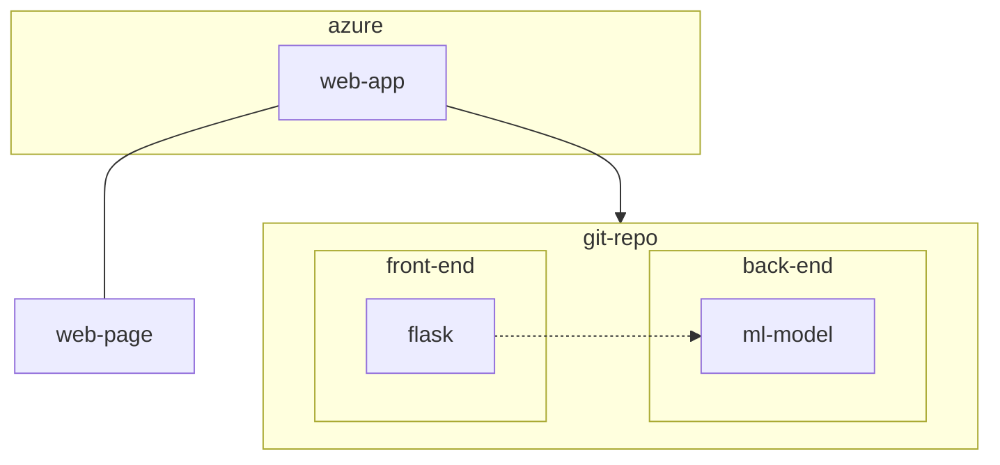
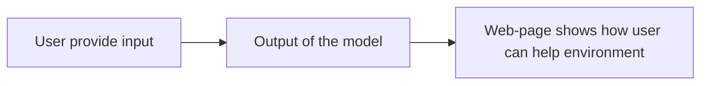

# swollen
BeeSafe: Comprehensive Risk Assessment for Bee Conservation

https://pypi.org/user/fedirek/

Bee Score: Enhancing Pollination, Sustaining Life
Awareness of Bee score can increase pollination by 30%
Don’t wait get your score

## Architecture
### Data flow

### QA

* MR to main from uat
* test in local first

## User navigation

