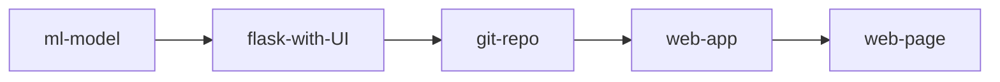

# swollen
BeeSafe: Comprehensive Risk Assessment for Bee Conservation

## Architecture
### Data flow

```mermaid
  flowchart LR
    ml-model --> flask-with-UI --> git-repo --> web-app --> web-page
```

### QA

* MR to main from uat
* test in local first
