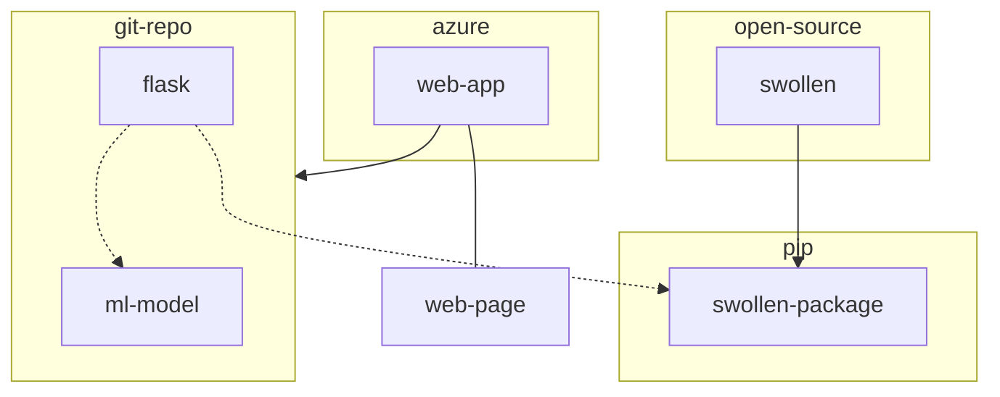
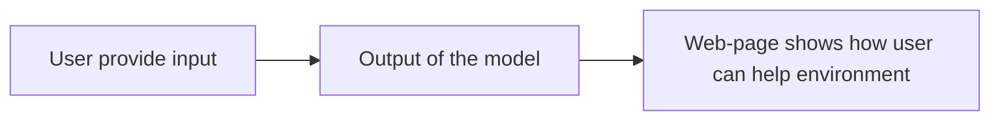

# swollen
BeeSafe: Comprehensive Risk Assessment for Bee Conservation

## Architecture
### Data flow

```mermaid
  flowchart TB
    subgraph git-repo
      ml-model
      flask
    end
    subgraph azure
    web-app
    end
    subgraph pip
    swollen-package
    end
    subgraph open-source
    swollen
    end
    swollen --> swollen-package
    web-app --- web-page
    flask -.-> ml-model
    flask -.-> swollen-package
    web-app --> git-repo
```

## User navigation

```mermaid
  flowchart LR
      A["User provide input"] --> B["Output of the model"] --> C["Web-page shows how user can help environment"]
```
